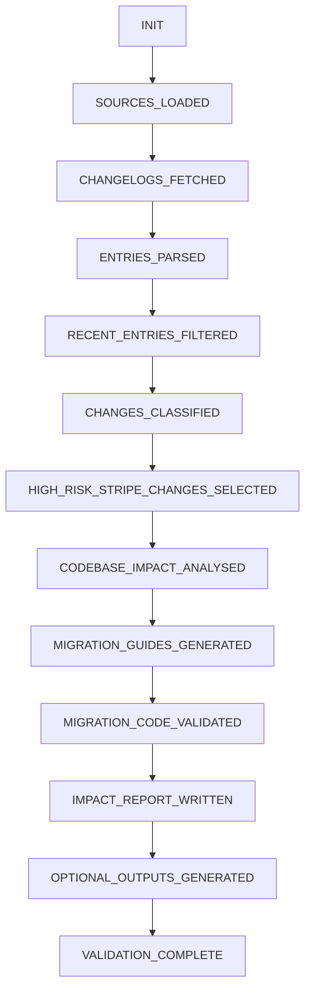

# Changelog Monitoring Pipeline

A replayable, deterministic pipeline that monitors public SDK and API changelogs, classifies changes by type and breaking-risk, evaluates high-risk changes against your codebase, and generates automated migration guides.

## Features

- **Multi-Format Parsing:** Fetch and deterministically parse both Markdown and HTML changelogs gracefully.
- **LLM-Powered Classification:** Uses Gemini 2.5 Flash to classify changelog entries (deprecation, breaking, enhancement, bugfix, security) and breaking risk levels.
- **Taxonomy Validation:** Strict validation of LLM outputs against a controlled taxonomy before moving to the next pipeline stage.
- **Codebase Impact Analysis:** Evaluates detected high-risk SDK breaking changes against your specific codebase to identify precisely which functions are affected.
- **Automated Migration Guides:** Generates `before_code` and `after_code` for affected functions.
- **Code Validation:** Generated python migration guides are automatically validated using Python's `ast.parse()` to ensure syntactical correctness.
- **Impact Reporting:** Outputs a comprehensive developer `impact_report.md` alongside stretch artifacts like `security_alerts.json` and `version_pinning.md`.

## Architecture & Stages

The pipeline is built on a strict **State Machine** architecture that enforces stage ordering and ensures every intermediate artifact is written to disk for complete auditability.



*Every LLM call is precisely logged into `llm_calls.jsonl` along with prompt hashes, source IDs, and artifacts used.*

## Getting Started

### 1. Prerequisites
- Python 3.10+
- Google Gemini API Key

### 2. Installation
Clone the repository and install the minimal dependencies:
```bash
git clone https://github.com/karthikeyan1134/AuditAPI.git
cd AuditAPI
pip install -r requirements.txt
```

### 3. Configuration
Rename the provided `.env.example` to `.env` and insert your API key:
```env
GEMINI_API_KEY=your_gemini_api_key_here
```

### 4. Running the Pipeline
You can run the full pipeline sequentially:
```bash
make run
# or
python run_pipeline.py
```

### 5. Validating Artifacts
To verify that the pipeline correctly generated all artifacts, schemas, and fulfilled all constraints:
```bash
make validate
# or
python validate.py
```
This script checks 38 individual constraints across artifacts, logs, code, and report structures.

## Generated Artifacts
After a successful run, you will find the following artifacts in your root directory:
- `parsed_changelogs/` - Deterministically parsed entries from each source.
- `classified_changes.json` - Classified changes outputted by the LLM.
- `codebase_impact.json` - Per-function impact analysis matrix.
- `migration_guides.md` - Generated before/after fixes.
- `migration_validation.json` - Syntax validation results.
- `impact_report.md` - Executive summary and final impact report.
- `llm_calls.jsonl` - Append-only audit log for LLM invocations.
- `pipeline_history.json` - Execution timeline metadata.
- *Plus optional stretch goals (`security_alerts.json`, `version_pinning.md`, etc.).*
