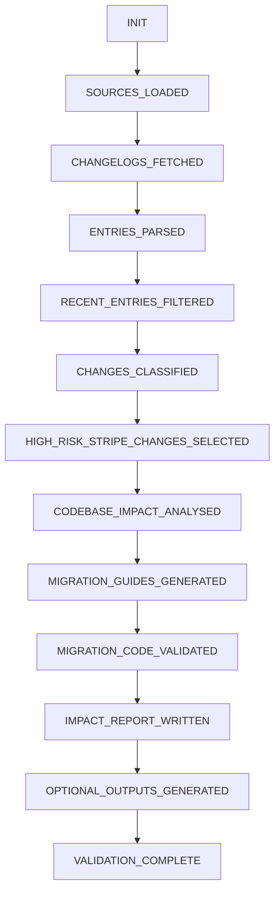

# Changelog Monitoring Pipeline

A robust, replayable pipeline that automates the tedious task of reading SDK and API changelogs. 

Instead of manually checking GitHub or documentation sites for breaking changes, this pipeline fetches the latest updates, uses **Google Gemini AI** to classify them by risk level, and checks if those breaking changes actually affect *your* code. If they do, it even writes the code to fix it for you!

---

## 🌟 What This Pipeline Does

1. **Fetches & Parses:** Downloads the latest changelogs from defined URLs (supports both Markdown and HTML pages).
2. **Filters Noise:** Automatically ignores any changes older than 90 days.
3. **Classifies Risk:** Uses AI to read the change and categorize it (`deprecation`, `breaking`, `enhancement`, `bugfix`, `security`) along with a breaking risk level (`critical`, `high`, `medium`, `low`, `none`).
4. **Analyzes Impact:** Takes critical breaking changes and compares them against your actual codebase to see if your functions are affected.
5. **Generates Fixes:** If your code is broken by an update, the pipeline generates a `before_code` and `after_code` migration guide.
6. **Validates Fixes:** Automatically tests the generated Python code to ensure it doesn't have syntax errors.
7. **Builds a Report:** Compiles a final human-readable `impact_report.md` detailing everything it found.

---

## ⚙️ How It Works (The Architecture)

The system uses a strict **State Machine** architecture. This guarantees that stages run in the exact correct order, and all intermediate data is saved to disk so you can audit exactly what the AI was thinking at every step.



---

## 🚀 Getting Started

Follow these steps to run the pipeline on your own machine.

### 1. Prerequisites
- **Python 3.10 or newer** installed on your system.
- A **Google Gemini API Key** (It's free! Get one at [Google AI Studio](https://aistudio.google.com/apikey)).

### 2. Installation
Clone the repository to your local machine and install the required dependencies:
```bash
git clone https://github.com/karthikeyan1134/AuditAPI.git
cd AuditAPI
pip install -r requirements.txt
```

### 3. Setup Your API Key
The pipeline needs your Gemini API key to run the AI classifications. 
1. Copy the example environment file:
   - On Mac/Linux: `cp .env.example .env`
   - On Windows: `copy .env.example .env`
2. Open the new `.env` file in a text editor.
3. Replace the placeholder with your actual API key:
   ```env
   GEMINI_API_KEY=your_actual_key_here
   ```

---

## 🛠️ How to Configure the Pipeline

The pipeline is highly configurable. You control what it monitors by editing two files:

### 1. `changelog_sources.json`
This file tells the pipeline which changelogs to fetch. To monitor a new SDK, simply add it to the list!
```json
{
  "source_id": "github_repo_name",
  "name": "Human Readable Name",
  "url": "https://raw.githubusercontent.com/.../CHANGELOG.md",
  "format": "markdown" // Use "html" for web pages
}
```

### 2. `codebase_snippet.py`
This file represents your application's code. The AI will read this file and compare it against the changelogs to see if any of your functions are broken by an update. Simply paste the functions you want to monitor into this file.

---

## ▶️ Running the Pipeline

Once configured, you can execute the entire pipeline with a single command:

**Using Make (Mac/Linux):**
```bash
make run
```

**Using Python Directly (Windows/Any):**
```bash
python run_pipeline.py
```
*Note: The pipeline takes about 3-5 minutes to complete, as it must carefully read and classify hundreds of changelog entries using the AI.*

---

## 🧪 Validating the Output

Because AI can sometimes be unpredictable, this project includes a strict validation suite. After running the pipeline, you can run the validator to ensure all files were generated correctly and adhere to the strict taxonomy.

**Using Make:**
```bash
make validate
```
**Using Python:**
```bash
python validate.py
```
*This will run 38 strict checks against the generated artifacts.*

---

## 📂 Understanding the Output Files

When the pipeline finishes, it will generate several files. Here's what they mean:

- 📝 **`impact_report.md`**: Start here! This is the human-readable executive summary of everything the pipeline found.
- 🔄 **`migration_guides.md`**: Contains the `before_code` and `after_code` blocks to fix any broken functions.
- 🚨 **`security_alerts.json`**: Any changelog entries that the AI flagged as security vulnerabilities.
- 📌 **`version_pinning.md`**: Recommendations on exactly which versions to pin in your `package.json` or `requirements.txt` to avoid breaking changes.
- 🧠 **`classified_changes.json`**: The raw AI classification data for every single changelog entry it read.
- 📜 **`llm_calls.jsonl`**: A meticulous audit log of every single request made to the Google Gemini API.

---

## 🧹 Cleaning Up

To delete all the AI-generated reports and reset the repository to a clean state, run:
```bash
make clean
```
